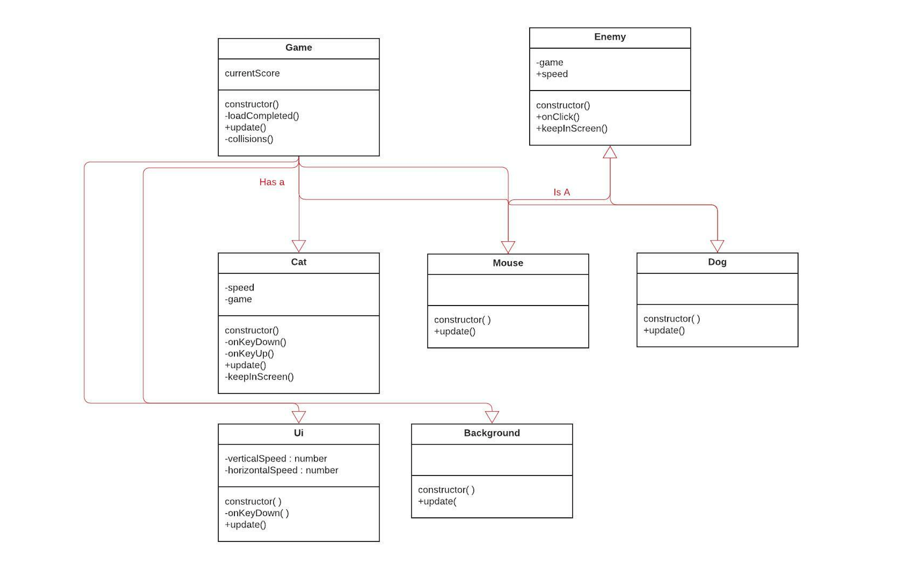

# mousecatcher
Deze readme file bevat uitleg over de eindgame die is gemaakt voor het vak programmeren 4, de game heet Mouse Catcher. De progressie die is gedaan is terug te zien in de commits in deze repository (voor dit vak heb ik met Github Desktop gewerkt om alles bij te houden).

## Github pages
https://michafvdw.github.io/mousecatcher/

## Youtube video 
https://youtu.be/IffDWDXs2jM

## Beschrijving spel 
In het spel Mouse Catcher speel je als een tovenaarskat met als doel om in de dungeon waar je je bevindt alle muizen te vermoorden. Echter is er een obstakel, namelijk de ridder hond. Deze probeert je te pakken voordat je alle muizen kan vermoorden. 

## Spel uitleg
Met de pijl omhoog (↑) en de pijl omlaag (↓) kun je de kat besturen, het doel is dus om de hond niet aan te raken maar wel alle muizen. Voor elke muis die je aanraakt krijg je een punt bij je score. Als je het spel nog een keer wilt spelen moet je de pagina herladen. Als je 10 punten hebt gehaald heb je gewonnen (want er zijn 10 muizen in het spel). 

## Prototypes
Voor programmeren 4 heb ik ook 3 prototypes gemaakt die allemaal verschillende game mechanics gebruiken. Ik heb deze op aparte repositories gepost en ook online gezet met github pages. Ze zijn met de volgende links te bekijken met bijbehorende uitleg:

Prototype 1:  https://github.com/michafvdw/prototype1_keyboardcontrol 

Prototype 2: https://github.com/michafvdw/prototype2_collisions

Prototype 3: https://github.com/michafvdw/prototype3_scoreUI

## Klassendiagram 

